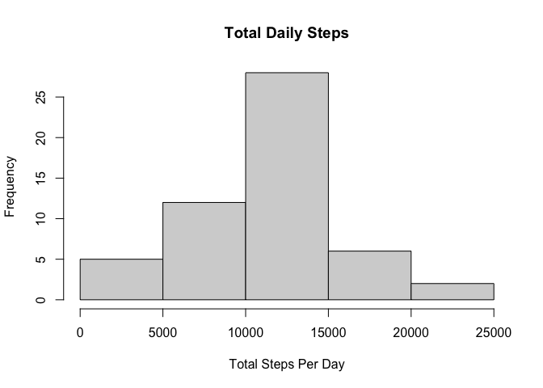
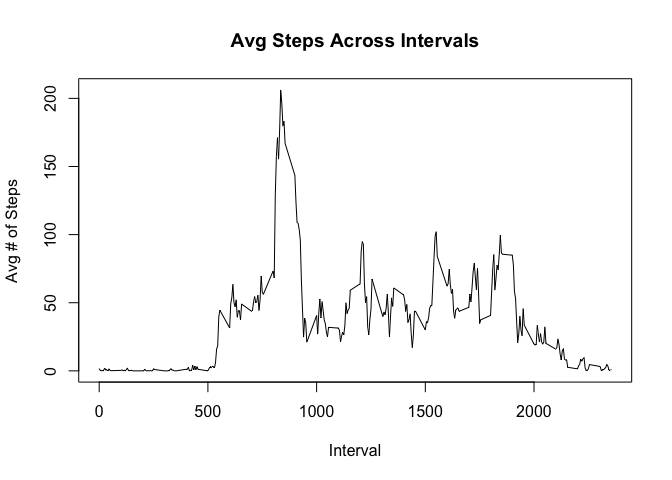
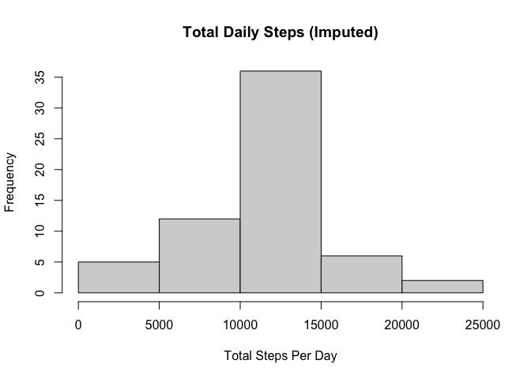

## Loading and preprocessing the data

```r
if (!file.exists("activity.csv")) {unzip('activity.zip')}
dataset <- read.csv(file = 'activity.csv', header=TRUE, colClasses =c("integer","Date","integer"))
```
---

## What is mean total number of steps taken per day?

<!-- -->

Mean and median of daily steps

```r
mean_dly_steps <- mean(day_steps$tot_steps, na.rm=TRUE)
median_dly_steps <- median(day_steps$tot_steps, na.rm=TRUE)
```
`Mean` daily steps = **10766**

`Median` daily steps = **10765**

---

## What is the average daily activity pattern?

<!-- -->

The interval with the most average steps activity

```r
max_int <- as.character(interval_steps[which.max(interval_steps$avg_steps),1])
```
Interval with the highest avg daily steps = **835**

---

## Imputing missing values

From the dataset summary, we can see that the only field that has NA values is "Steps". We also get the count of those NAs

```r
summary(dataset)
```

```
##      steps             date               interval     
##  Min.   :  0.00   Min.   :2012-10-01   Min.   :   0.0  
##  1st Qu.:  0.00   1st Qu.:2012-10-16   1st Qu.: 588.8  
##  Median :  0.00   Median :2012-10-31   Median :1177.5  
##  Mean   : 37.38   Mean   :2012-10-31   Mean   :1177.5  
##  3rd Qu.: 12.00   3rd Qu.:2012-11-15   3rd Qu.:1766.2  
##  Max.   :806.00   Max.   :2012-11-30   Max.   :2355.0  
##  NA's   :2304
```

There are  **2304** missing values in the dataset. To address the missing values values, I decided to impute the average number of steps for a given interval

```r
ds_impute <- dataset %>% group_by(interval) %>% mutate(steps = ifelse(is.na(steps), mean(steps,na.rm=TRUE), steps))
summary(ds_impute)
```

```
##      steps             date               interval     
##  Min.   :  0.00   Min.   :2012-10-01   Min.   :   0.0  
##  1st Qu.:  0.00   1st Qu.:2012-10-16   1st Qu.: 588.8  
##  Median :  0.00   Median :2012-10-31   Median :1177.5  
##  Mean   : 37.38   Mean   :2012-10-31   Mean   :1177.5  
##  3rd Qu.: 27.00   3rd Qu.:2012-11-15   3rd Qu.:1766.2  
##  Max.   :806.00   Max.   :2012-11-30   Max.   :2355.0
```

Histogram of steps per day, with imputed values
<!-- -->

`Mean` and `Median` with imputed values

```r
print(mean_dly_steps_impute <- mean(day_steps_impute$tot_steps))
```

```
## [1] 10766.19
```

```r
print(median_dly_steps_impute <- median(day_steps_impute$tot_steps))
```

```
## [1] 10766.19
```
Imputing the interval's mean steps into null Steps values resulted in 8 more days with steps between 10,000 and 15,000, and drove the median to be equal to the mean. Daily mean steps were not impacted.


## Are there differences in activity patterns between weekdays and weekends?

Create a new factor variable in the dataset with two levels – “weekday” and “weekend” indicating whether a given date is a weekday or weekend day.

```r
ds_impute$day_of_week <- ifelse(weekdays(ds_impute$date) %in% c("Saturday","Sunday"),"weekend","weekday")
```

Time series plot of intervals and average number of steps taken, by weekend/weekday

```r
interval_steps_impute <- ds_impute %>% group_by(interval,day_of_week) %>% summarise_at(vars("steps"),mean)


xyplot(steps ~ interval | day_of_week, data = interval_steps_impute, layout = c(1,2), type = "l", xlab = "Interval", ylab = "Number of steps")
```

<!-- -->
